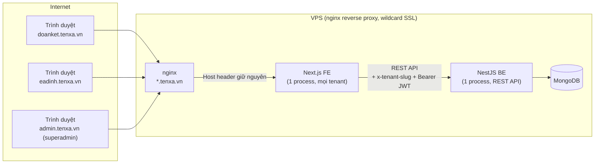
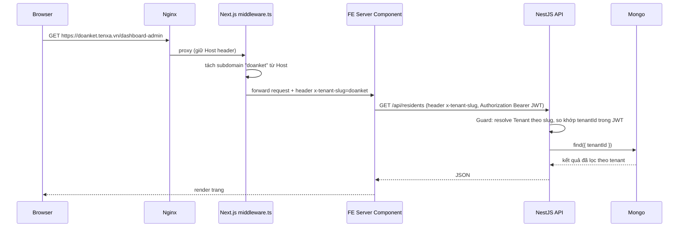
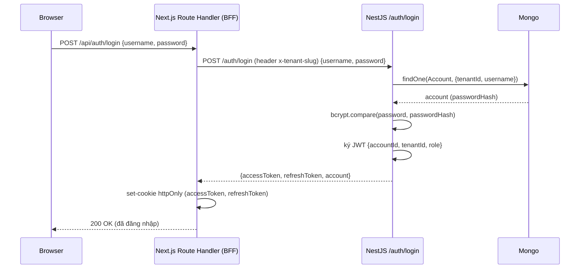
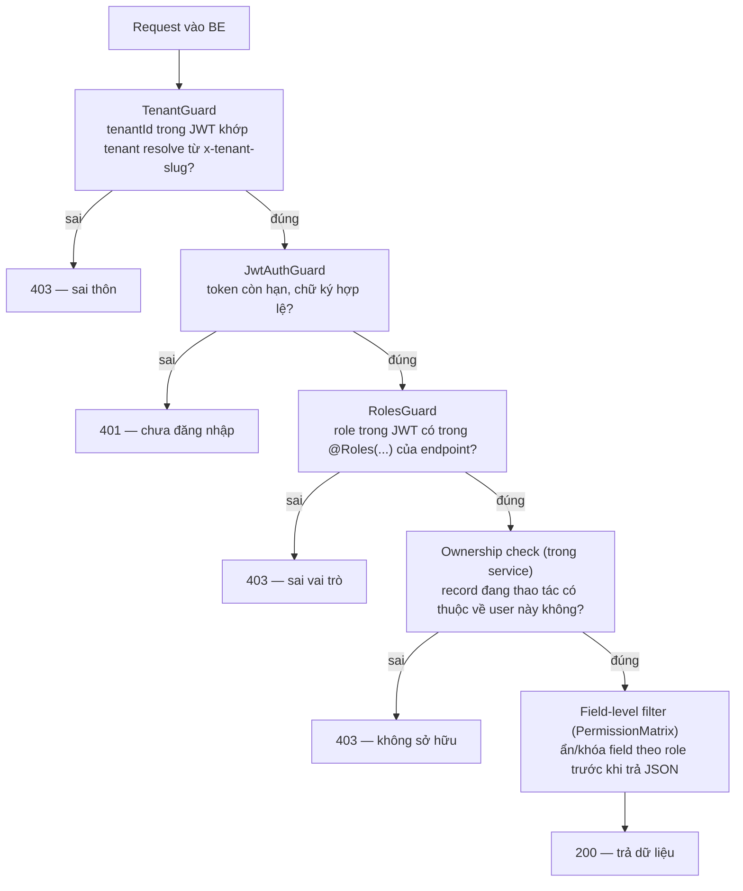
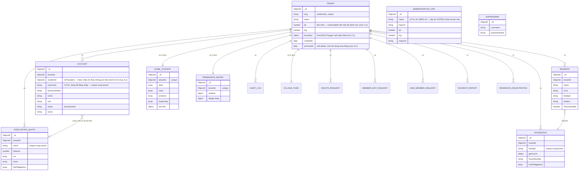
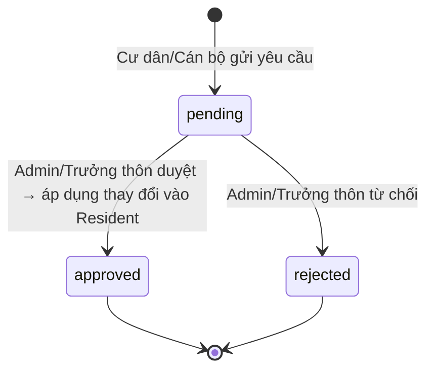

# Dự án: Hệ thống Quản lý Thôn đa tenant (multi-tenant)

Tài liệu thiết kế kỹ thuật — công nghệ, sơ đồ kiến trúc, mô hình dữ liệu, logic nghiệp vụ. **Chưa khởi tạo dự án**, tài liệu này dùng để thống nhất thiết kế trước khi code.

## 1. Bối cảnh & mục tiêu

Hiện có 1 prototype "Cổng Thông Tin Điện Tử Thôn Đoàn Kết" tại `E:\Dev\cong-thong-tin-thon` (HTML/Tailwind-CDN tĩnh, logic chia theo file trong thư mục `js/`), mô hình hóa đúng **1 thôn**, dữ liệu (`villageDb`) lưu trong `localStorage`, không có backend thật. Cấu trúc `js/`:

| File | Nội dung |
|---|---|
| `data.js` | State gốc `villageDb` (residents, accounts, funds, associationQuotas, permissions, villageFund, auditLogs...) + `defaultAccounts` |
| `app-init.js` | Khởi tạo session (`currentRole`, `currentUser`), state UI dùng chung |
| `navigation.js` | Định nghĩa tab/menu theo từng role (`roleTabs`) |
| `homepage.js` | Render trang chủ công khai (thống kê, tin tức, quỹ thôn) |
| `resident-dashboard.js` | Dashboard Cư dân |
| `resident-requests.js` | Cư dân gửi yêu cầu (sửa thông tin, thêm/xóa thành viên) |
| `hoi-vien.js` | Quản lý hội viên (chi hội/đoàn) |
| `truong-thon.js` | Dashboard Trưởng thôn (duyệt yêu cầu, quỹ thôn) |
| `antt.js` | Dashboard Tổ ANTT (tin báo, đăng ký lưu trú) |
| `admin-accounts.js` | Admin: quản lý tài khoản, duyệt yêu cầu xóa |
| `admin-content.js` | Admin: cấu hình nội dung trang chủ, thông tin ngân hàng |

**Đây là tham chiếu duy nhất của tài liệu này** — cho cả UI/UX, dữ liệu mẫu lẫn logic nghiệp vụ. Hệ thống mới (FE Next.js + BE NestJS) được xây **mới hoàn toàn**, không kế thừa code, chỉ tham chiếu layout/màu sắc/UX và nghiệp vụ đã có trong các trang: `index.html` (trang chủ thôn), `dang-nhap.html`, `dashboard-{admin,antt,canbo,cu-dan,truongthon}.html`, và **`tra-cuu.html`** (trang tra cứu/tìm thôn-buôn theo bản đồ SVG + ô tìm kiếm, liệt kê nhiều thôn/buôn trong 1 xã).

Mục tiêu: xây một hệ thống **SaaS multi-tenant** — nhiều thôn/xã dùng chung 1 bộ mã nguồn (FE + BE), mỗi thôn là 1 tenant độc lập, truy cập qua **subdomain riêng** (vd `doanket.tenxa.vn`, `eadinh.tenxa.vn`), dữ liệu tách biệt hoàn toàn theo tenant. Thôn "Đoàn Kết" hiện tại trở thành tenant thật đầu tiên.

## 2. Công nghệ sử dụng

| Thành phần | Công nghệ | Ghi chú |
|---|---|---|
| Frontend | Next.js 15+ (App Router) + TypeScript | Xây mới, dựa trên UI/UX của `E:\Dev\cong-thong-tin-thon` |
| CSS | Tailwind CSS (build qua PostCSS) | Prototype dùng CDN (`cdn.tailwindcss.com`) — không phù hợp production, build lại qua PostCSS như chuẩn Next.js |
| Icon | Font Awesome (`@fortawesome/fontawesome-free` hoặc `react-fontawesome`) | Giữ đúng bộ icon dùng khắp prototype (45+ icon chỉ riêng trang chủ) |
| Bản đồ | Leaflet + tile OpenStreetMap | Miễn phí, không cần API key (khác Mapbox/Google Maps). Dùng ở 2 nơi: trang danh mục thôn (mục 4.1) và xem GPS hộ gia đình (mục 8.3) |
| Animation | Không dùng thư viện nào (không Framer Motion) | Prototype chỉ dùng Tailwind `transition`/`duration`/hover state + 1 `@keyframes spin` cho loading — tái tạo bằng CSS thuần |
| Validate form | `zod` | Khớp kiểu dữ liệu với DTO + `class-validator` bên NestJS, tránh lệch validate FE/BE |
| Gọi API (FE→BE) | `fetch` gốc trong Server Component (đính JWT từ cookie) + Route Handler làm BFF riêng cho login/logout | Không cần thêm lib (axios/SWR) vì phần lớn là đọc dữ liệu 1 lần lúc render, không polling realtime |
| Backend | NestJS + TypeScript | Repo riêng `thon-so-be`, expose REST API |
| ORM | Mongoose | NestJS `@nestjs/mongoose` |
| Database | MongoDB | Tự host trên VPS (cài native, không dùng Atlas) |
| Auth | JWT (access + refresh token), bcrypt hash mật khẩu, cookie `httpOnly` do FE tự set (không dùng next-auth) | Cấp bởi BE, FE lưu trong cookie `httpOnly` |
| Reverse proxy | nginx | Định tuyến theo subdomain, wildcard SSL |
| Hosting | VPS tự quản | 1 VPS chạy cả FE (Next.js) + BE (NestJS) + MongoDB, hoặc tách VPS/service riêng khi cần scale |
| Process manager | PM2 hoặc systemd | Giữ 2 tiến trình Node (FE, BE) chạy nền, tự restart |

## 3. Kiến trúc tổng thể



**Nguyên tắc quan trọng:** chỉ **1 process FE** và **1 process BE** phục vụ **tất cả** các tenant — không tạo process/container riêng cho mỗi thôn. Sự phân biệt tenant hoàn toàn nằm ở tầng logic (đọc subdomain → resolve tenant → lọc dữ liệu theo `tenantId`), không phải ở tầng hạ tầng.

## 4. Phân giải tenant theo subdomain



- **FE middleware** (`middleware.ts`, Next.js Edge runtime): chỉ tách chuỗi subdomain từ `Host`, không query DB ở đây (Edge runtime không phù hợp gọi DB) — chỉ set header `x-tenant-slug` rồi forward.
- **BE (NestJS)** chịu trách nhiệm xác thực slug có tồn tại thật không, và là nơi duy nhất chạm MongoDB.
- **Dev local:** dùng `*.localhost` (vd `doanket.localhost:3000`) — trình duyệt/Node hiện đại tự resolve về `127.0.0.1`, không cần sửa hosts file.
- Subdomain không khớp tenant nào → BE trả `404`, FE hiển thị trang "Không tìm thấy thôn này".

### 4.1 Trang danh mục tenant ở domain gốc (dựa trên `tra-cuu.html`)

Domain gốc không có subdomain (`tenxa.vn`) phục vụ 1 trang riêng — **danh mục tra cứu thôn/buôn** — dựa trên UI mẫu `tra-cuu.html`: bản đồ + ô tìm kiếm gợi ý theo tên, click/chọn 1 thôn sẽ điều hướng sang đúng subdomain của thôn đó (`<slug>.tenxa.vn`).

- Route FE riêng (vd `/` tại domain gốc, khác với `/` bên trong 1 tenant) — middleware phân biệt: không có subdomain hợp lệ nào ứng với `Host` → render trang danh mục thay vì trang chủ 1 thôn.
- Bản đồ dùng **Leaflet + tile OpenStreetMap** (thay vì SVG vẽ tay như bản mẫu) — mỗi thôn hiển thị bằng **polygon ranh giới thật** (`Tenant.boundary`, GeoJSON Polygon — xem mục 6), không chỉ 1 điểm marker, để giữ đúng trải nghiệm "thấy hình dạng thật của từng thôn" như bản mẫu.
- Dữ liệu render: `GET /tenants/public` (BE, không cần auth) trả `{ slug, name, boundary, lat, lng }` cho mọi tenant đang active — thay thế mảng `REGIONS` cứng trong bản HTML mẫu.
- Đây là điểm vào duy nhất cho người dân *chưa biết* subdomain thôn mình, nên cần tối ưu tìm kiếm mờ (fuzzy) như bản mẫu (so khớp theo `indexOf` tên thôn).

**Nguồn dữ liệu ranh giới thật để khởi tạo (bootstrap):** khi làm prototype, đã phát hiện API công khai `https://tracuudlieya.io.vn/api/communes/dlieya/geojson` trả về đúng ranh giới GeoJSON thật (không phải suy nội/vẽ tay) cho toàn bộ 24 thôn/buôn của xã Dliê Ya, kèm `properties.units` — danh sách trụ sở cơ quan cấp xã (Đảng ủy, HĐND-UBND, MTTQ, Công an) với tên + logo + link Google Maps thật. Khi seed dữ liệu cho tenant đầu tiên ("Đoàn Kết"), script migrate (mục 11, bước 1) nên import trực tiếp từ nguồn này thay vì nhập tay tọa độ — độ chính xác cao hơn nhiều so với áng chừng bằng mắt. Nếu các xã khác cũng có nguồn tương tự, đây là cách nhanh nhất để onboard tenant mới có ranh giới thật ngay từ đầu thay vì chờ đo đạc.

## 5. Xác thực & phân quyền (Auth)



- **FE đóng vai trò BFF (Backend-For-Frontend)** cho riêng bước login/logout: browser không nhận JWT trực tiếp, chỉ nhận cookie `httpOnly` do chính FE (cùng domain/subdomain với browser) set — tránh phức tạp CORS/cookie cross-domain giữa FE và BE.
- Các request dữ liệu khác: FE Server Component/Route Handler đọc JWT từ cookie, gắn vào header `Authorization: Bearer <token>` khi gọi BE.
- **Vai trò (Role)** giữ nguyên 5 role hiện có: `resident`, `association-officer`, `village-head`, `security-team`, `admin` — mỗi role có 1 dashboard riêng, kiểm soát qua NestJS Guard (`RolesGuard`) đọc claim `role` trong JWT.
- **Superadmin** (quản lý toàn hệ thống, tạo/xóa tenant): 1 role riêng, **không gắn tenant nào** (không có `tenantId` trong JWT), chỉ truy cập qua subdomain riêng `admin.tenxa.vn`.
- Mật khẩu: hash bằng `bcrypt`, không còn dùng chung `"doanket"` cho mọi tài khoản như bản demo cũ.

### 5.1 Mô hình phân quyền tổng hợp (4 lớp, chạy tuần tự qua guard)



1. **Tenant isolation** (mục 6.1) — ranh giới cứng ngoài cùng, không có ngoại lệ.
2. **Role-based** — 5 role + superadmin, thực thi bằng `@Roles(...)` + `RolesGuard`, tương ứng cột "Vai trò gọi" ở bảng API (mục 9).
3. **Ownership** — hẹp hơn role: `resident` chỉ thao tác `Household`/request có `familyId` khớp hộ mình (suy ra qua CCCD ↔ tài khoản); `association-officer` chỉ thao tác `AssociationQuota` có `name` khớp `Account.assoc`. Check này nằm trong service, không phải guard chung, vì cần so khớp dữ liệu cụ thể.
4. **Field-level** — mịn nhất, admin của từng thôn tự cấu hình qua `PermissionMatrix` (mục 8.5): ẩn/khóa field nhạy cảm (`cccd`, `dob`, `villageFund`, `gpsAddress`) theo role, áp dụng khi BE serialize response (không chỉ ẩn ở FE — tránh lộ qua gọi API trực tiếp).

### 5.2 Bảo mật

| Rủi ro | Biện pháp |
|---|---|
| Brute-force đăng nhập | Rate limit `/auth/login` theo IP + username (NestJS `@nestjs/throttler`), khóa tạm sau N lần sai |
| JWT bị đánh cắp / cần thu hồi khi logout | Access token sống ngắn (vd 15 phút); refresh token lưu kèm trong 1 collection `RefreshToken` (không chỉ ký JWT thuần) để có thể revoke khi logout hoặc khi admin khóa tài khoản — JWT thuần không tự thu hồi được |
| CSRF (request giả mạo từ site khác dùng cookie có sẵn) | Cookie `sameSite: lax` (đã có) + BE kiểm tra header `Origin`/`Referer` khớp domain hệ thống trên mọi request đổi trạng thái (POST/PATCH/DELETE) |
| XSS qua nội dung admin nhập (tin tức, mô tả...) | Next.js/React tự escape khi render text thường; riêng field cho phép rich text (nếu có) phải sanitize (`sanitize-html`) trước khi lưu, không render `dangerouslySetInnerHTML` với dữ liệu chưa lọc |
| NoSQL injection (Mongoose) | Validate toàn bộ input bằng DTO + `class-validator` trước khi vào query; không bao giờ đưa thẳng `req.body`/`req.query` làm filter Mongo (chặn `$where`, object injection) |
| Lộ dữ liệu nhạy cảm (CCCD, SĐT) qua log | Audit log (mục 8, `AuditLog`) không ghi `passwordHash`; log ứng dụng (không phải AuditLog nghiệp vụ) không log toàn bộ request body có CCCD/mật khẩu |
| Truy cập DB trực tiếp từ ngoài | MongoDB bind `127.0.0.1`, bật `--auth` (đã nêu ở mục 10) |
| Secrets | `MONGODB_URI`, `JWT_ACCESS_SECRET`, `JWT_REFRESH_SECRET` chỉ nằm trong biến môi trường (`.env`, không commit), không hardcode |
| Superadmin bị chiếm quyền | Vì đây là quyền cao nhất (tạo/xóa cả 1 thôn), cân nhắc thêm rate-limit nghiêm ngặt hơn + xem xét 2FA cho riêng tài khoản superadmin ở giai đoạn sau |

## 6. Mô hình dữ liệu (ERD)



**Nguyên tắc bắt buộc:** mọi collection (trừ `Tenant` và `SuperAdmin`) đều có field `tenantId`, và **mọi query đều phải filter theo `tenantId`** — đây là ranh giới cách ly dữ liệu duy nhất giữa các thôn. BE nên có 1 lớp middleware/interceptor tự động tiêm `tenantId` từ JWT vào mọi query (tránh việc developer quên filter, gây rò rỉ dữ liệu chéo tenant).

**`ADMINISTRATIVE_UNIT`** là ngoại lệ có chủ đích: trụ sở cơ quan cấp **xã** (Đảng ủy, HĐND-UBND, MTTQ, Công an xã) không thuộc riêng thôn nào nên **không có `tenantId`** — hiển thị chung trên bản đồ danh mục (mục 4.1) cho mọi tenant thuộc cùng 1 xã. Quản lý qua route riêng của superadmin, không qua tenant nào.

### 6.1 Vận hành & cách ly dữ liệu ở tầng DB

**Mô hình: Shared Database, Shared Collection** — không tách 1 database/1 tenant, không tách schema riêng. Tất cả thôn dùng chung 1 MongoDB, chung collection, phân biệt bằng `tenantId`. Lý do:
- MongoDB không có khái niệm schema như Postgres nên "schema-per-tenant" không áp dụng tự nhiên; "database-per-tenant" thì phải quản lý N connection pool và chạy migration N lần mỗi khi đổi schema — không đáng với quy mô này.
- Quy mô mỗi thôn (~300-400 hộ, ~1600 nhân khẩu): dù vài trăm thôn thì tổng dữ liệu vẫn nhỏ (hàng trăm nghìn document), 1 MongoDB instance trên VPS xử lý thoải mái, chưa cần sharding.

**Cách ly — hoàn toàn ở tầng ứng dụng, DB không tự bảo vệ:** MongoDB không có row-level security như Postgres RLS, nên lọc theo tenant phải đúng 100% ở code, không có lưới an toàn từ DB. Giảm rủi ro bằng:
- 1 base repository/service dùng chung cho mọi module, method nào cũng bắt buộc nhận `tenantId` làm tham số đầu tiên — không cho phép gọi query trần không kèm tenant.
- Interceptor/guard NestJS tự tiêm `tenantId` từ JWT vào query context, controller không tự tay set.
- Test tích hợp riêng khẳng định "tenant A không bao giờ đọc được dữ liệu tenant B", chạy trong CI.

**Index bắt buộc** — mọi collection có `tenantId` cần compound index bắt đầu bằng `tenantId` để query tenant-scoped không full-scan:
```
Account:              { tenantId: 1, username: 1 }   — unique
Resident:             { tenantId: 1 }, { tenantId: 1, familyId: 1 }
Household:            { tenantId: 1, familyId: 1 }   — unique
AssociationQuota:     { tenantId: 1, name: 1 }        — unique
HomeContent/Permission/VillageFund: { tenantId: 1 }   — unique (1 doc/tenant)
Tenant:               { slug: 1 }                     — unique (gốc, không có tenantId)
```

### 6.2 Logic dữ liệu & toàn vẹn tham chiếu

**Sửa 1 điểm yếu của prototype:** trong `js/data.js`, `Account.username` chính là số CCCD của người đó, và việc "liên kết" Account ↔ Resident chỉ dựa vào **so khớp chuỗi** (username/CCCD hoặc tên) — không có tham chiếu ID thật. Cách này dễ vỡ khi: CCCD được cấp lại/đổi số, hai người trùng tên, hoặc nhân khẩu chưa có CCCD nên chưa tạo được tài khoản. Hệ thống mới sửa bằng cách thêm **`Account.residentId` (ObjectId, ref `Resident`)** — liên kết bằng ID thật, `username` (CCCD) chỉ còn là thông tin đăng nhập, không dùng để join dữ liệu.

**Xóa nhân khẩu (`DeleteRequest` approved):** giữ đúng hành vi prototype — xóa cứng khỏi collection `Resident` sau khi duyệt (không soft-delete), nhưng `AuditLogEntry.detail` đã lưu lại tên/thông tin tại thời điểm xóa nên vẫn truy vết được ai xóa ai, khi nào, vì lý do gì — không mất dấu vết dù mất bản ghi gốc.

**Thao tác nhiều document phải atomic:** một số hành động sửa từ 2 collection trở lên trong cùng 1 lần duyệt (vd duyệt `NewMemberRequest` → tạo mới `Resident` + đổi `status` của request đó) — dùng **Mongoose transaction** (`session.withTransaction`) để tránh trạng thái nửa vời nếu 1 trong 2 thao tác lỗi giữa chừng.

**Xóa/khóa 1 tenant (superadmin):** không xóa cứng ngay toàn bộ dữ liệu của thôn đó — đánh dấu `Tenant.archivedAt` (soft-delete ở cấp tenant), middleware tenant coi tenant đã archive như không tồn tại (trả 404 như slug sai), nhưng dữ liệu vẫn giữ nguyên trong DB để có thể khôi phục nếu thao tác nhầm; chỉ xóa vĩnh viễn qua thao tác thủ công riêng (ngoài phạm vi UI thông thường).

## 7. Cấu trúc module NestJS (BE)

```
thon-so-be/
├── src/
│   ├── tenant/            # TenantModule: resolve tenant theo slug, guard kiểm tra tenant hợp lệ
│   ├── auth/              # AuthModule: login, refresh token, JwtStrategy, RolesGuard
│   ├── accounts/          # CRUD tài khoản (Admin dashboard)
│   ├── residents/         # CRUD nhân khẩu, đồng bộ tài khoản từ nhân khẩu
│   ├── households/        # GPS, số nhà, khoản đóng góp quỹ thôn theo hộ
│   ├── requests/          # DeleteRequest, MemberEditRequest, NewMemberRequest (workflow duyệt)
│   ├── associations/      # Chi hội/đoàn: quỹ, giao dịch, khoản vay, khoản thu hội phí
│   ├── incidents/         # Báo ANTT
│   ├── residence/         # Đăng ký lưu trú
│   ├── home-content/      # Nội dung trang chủ (tin tức, sản phẩm, nhân sự...)
│   ├── permissions/       # Ma trận phân quyền theo role/field
│   ├── audit-log/         # Ghi log mọi hành động
│   ├── superadmin/        # Tạo/khóa/xóa tenant, quản lý toàn hệ thống
│   └── common/
│       ├── decorators/    # @CurrentTenant(), @CurrentUser(), @Roles(...)
│       ├── guards/        # TenantGuard, JwtAuthGuard, RolesGuard
│       └── schemas/       # Mongoose schema definitions (mirror ERD ở mục 6)
```

Mỗi module NestJS tương ứng với 1 hoặc vài file trong `js/` của bản prototype (`E:\Dev\cong-thong-tin-thon`, xem bảng ở mục 1) — giúp việc "chuyển" logic từ prototype tĩnh sang FE+BE có bản đồ rõ ràng, không đoán lại nghiệp vụ. Ví dụ: `accounts/` ↔ `admin-accounts.js`, `associations/` ↔ `hoi-vien.js`, `requests/` ↔ `resident-requests.js`, `households/`+`village-fund` ↔ phần quỹ thôn trong `truong-thon.js`, `incidents/`+`residence/` ↔ `antt.js`, `home-content/` ↔ `homepage.js`+`admin-content.js`.

## 8. Logic nghiệp vụ chính (kế thừa từ prototype hiện có)

### 8.1 Luồng duyệt (approval workflow) — dùng chung 1 pattern cho 3 loại request
`DeleteRequest`, `MemberEditRequest`, `NewMemberRequest` đều theo state machine:


Khi `approved`, BE thực hiện thay đổi thật lên collection `Resident` (xóa/sửa/thêm), đồng thời ghi `AuditLog`.

### 8.2 Đồng bộ tài khoản từ nhân khẩu
Admin có thể "Đồng bộ tài khoản": với mỗi `Resident` có CCCD hợp lệ nhưng chưa có `Account` tương ứng → tự tạo tài khoản `role: resident`, `username = cccd`. Bỏ qua nhân khẩu chưa có CCCD.

### 8.3 Quỹ thôn & quỹ hội
- **Household** giữ danh sách `fundObligations` (khoản phải đóng) theo hộ — cư dân "báo đã chuyển khoản" (`status: Chờ duyệt`), Trưởng thôn duyệt (`Đã đóng`) hoặc từ chối (`Chưa đóng`).
- **AssociationQuota** (theo từng chi hội) có `balance`, `txs` (Thu/Chi), `loans` (khoản vay hội viên), `feeObligations` (khoản thu định kỳ) — cán bộ hội quản lý độc lập theo hội mình phụ trách (`Account.assoc`).
- **GPS hộ gia đình** (`Household.gpsCoord`, lấy từ Geolocation API trình duyệt khi cư dân định vị nhà mình): hiển thị trực quan bằng **Leaflet + tile OpenStreetMap** trên dashboard Cư dân (xem vị trí nhà mình), và Trưởng thôn/Cán bộ Hội/Tổ ANTT (xem vị trí 1 hộ bất kỳ khi cần) — cùng thư viện dùng ở trang danh mục tenant (mục 4.1), không thêm lib map thứ hai.
  - **Pattern "bản đồ bối cảnh"** (đã kiểm chứng trên prototype, nên giữ nguyên khi rebuild): vẽ ranh giới của **mọi thôn trong xã** làm bối cảnh xung quanh, nhưng chỉ tô màu thật cho đúng thôn của hộ đang xem (`fillColor` theo `Tenant.color`/tương đương) — các thôn khác để nền trắng, viền xám mờ, `interactive: false` (không bắt sự kiện click). Bản đồ `fitBounds()` theo đúng ranh giới thôn đó (không zoom theo cả xã), rồi đặt 1 marker duy nhất tại tọa độ hộ. Cách này giúp người xem định vị được hộ nằm ở đâu **trong** thôn mà không mất ngữ cảnh các thôn lân cận, mà không cần tải/hiển thị dữ liệu hộ của thôn khác (chỉ ranh giới, không phải dữ liệu nhạy cảm).
  - **Lưu ý kỹ thuật Leaflet (rebuild bằng react-leaflet vẫn cần chú ý):** phải gọi tương đương `setView()`/gán center-zoom **trước** khi thêm tile layer — thêm tile layer vào 1 map chưa có view sẽ ném lỗi runtime (`"Set map center and zoom first"`) và dừng toàn bộ phần vẽ tiếp theo (polygon, marker) mà không có thông báo rõ ràng cho người dùng. Tương tự, không init map trong lúc container còn `display:none` (vd modal chưa mở) — phải hiện container trước, gọi `invalidateSize()` sau khi hiện.

### 8.4 Báo ANTT & đăng ký lưu trú
- `IncidentReport`: cư dân gửi tin báo (kèm GPS tùy chọn) → Tổ ANTT tiếp nhận → xử lý (`Mới → Đã tiếp nhận → Đã xử lý`).
- `ResidenceRegistration`: cư dân đăng ký lưu trú cho khách → Tổ ANTT duyệt/từ chối.

### 8.5 Phân quyền theo field
`PermissionMatrix` quy định mỗi role được `view` / `view-edit` / `locked` với từng field nhạy cảm (`cccd`, `dob`, `villageFund`, `gpsAddress`) — Admin cấu hình qua tab riêng, BE enforce khi trả dữ liệu (ẩn/khóa field theo quyền thay vì chỉ ẩn ở FE).

### 8.6 Quản trị đa tenant (Superadmin)
- Tạo tenant mới: nhập `slug` (subdomain) + `name` → tạo `Tenant` + 1 `Account` admin đầu tiên cho tenant đó.
- Khóa/mở tenant (tạm ngưng truy cập toàn bộ thôn).
- Xem danh sách tenant, thống kê cơ bản (số tài khoản, số nhân khẩu) theo từng thôn.

## 9. API endpoints (rút gọn, theo module)

| Method | Endpoint | Vai trò gọi | Mô tả |
|---|---|---|---|
| POST | `/auth/login` | public (trong tenant) | Đăng nhập, trả JWT |
| POST | `/auth/refresh` | đã đăng nhập | Cấp lại access token |
| GET/POST/PATCH | `/accounts` | admin | CRUD tài khoản |
| POST | `/accounts/sync-from-residents` | admin | Đồng bộ tài khoản từ nhân khẩu |
| GET/PATCH | `/residents` | admin, village-head | Danh sách/sửa nhân khẩu |
| POST | `/requests/delete`, `/requests/member-edit`, `/requests/new-member` | resident, association-officer | Gửi yêu cầu |
| PATCH | `/requests/:type/:id/approve|reject` | admin, village-head | Duyệt/từ chối |
| GET/PATCH | `/households/:familyId` | resident, village-head | GPS, số nhà, khoản đóng góp |
| GET/POST | `/associations/:name/transactions` | association-officer | Giao dịch quỹ hội |
| POST | `/incidents` | resident | Gửi tin báo ANTT |
| PATCH | `/incidents/:id/status` | security-team | Cập nhật trạng thái xử lý |
| POST | `/residence-registrations` | resident | Đăng ký lưu trú |
| PATCH | `/residence-registrations/:id/approve|reject` | security-team | Duyệt lưu trú |
| GET/PATCH | `/home-content` | public (GET), admin (PATCH) | Nội dung trang chủ |
| GET/PATCH | `/permissions` | admin | Ma trận phân quyền |
| GET | `/audit-log` | admin | Nhật ký hệ thống |
| GET | `/tenants/public` | public (không auth) | Danh sách tenant active + ranh giới, cho trang danh mục (mục 4.1) |
| GET | `/administrative-units` | public (không auth) | Trụ sở cơ quan cấp xã, hiển thị chung trên bản đồ danh mục |
| POST/GET/PATCH | `/superadmin/tenants` | superadmin | Tạo/xem/khóa tenant |
| POST/GET/PATCH | `/superadmin/administrative-units` | superadmin | CRUD trụ sở cơ quan cấp xã |

## 10. Triển khai hạ tầng (VPS)

- **nginx**: `server_name ~^(?<tenant>.+)\.tenxa\.vn$;` cho FE; `api.tenxa.vn` route riêng sang BE (subdomain cố định, không theo tenant vì BE tự resolve tenant qua header/JWT, không qua Host).
- **SSL wildcard**: bắt buộc dùng **DNS-01 challenge** (certbot + plugin DNS của nhà cung cấp domain) vì HTTP-01 không cấp được chứng chỉ wildcard `*.tenxa.vn`.
- **MongoDB**: cài native trên cùng VPS (không dùng Atlas). Bind `127.0.0.1` (không mở port DB ra ngoài Internet), bật `--auth` (user/password riêng cho DB), FE/BE kết nối qua `localhost` — nginx/firewall không route thẳng tới cổng Mongo.
- **Backup MongoDB**: cron job chạy `mongodump` định kỳ (khuyến nghị hằng đêm), nén và đẩy bản backup ra ngoài VPS (vd rclone lên 1 storage khác) — tránh mất cả app lẫn backup nếu VPS gặp sự cố.
- **Process management**: PM2 (`pm2 start` cho cả FE và BE, `pm2 startup` để tự khởi động cùng hệ thống), hoặc 2 unit `systemd` riêng.
- **Biến môi trường cần có**:
  - FE: `NEXT_PUBLIC_API_BASE_URL`, `SESSION_SECRET` (ký cookie nội bộ FE nếu BFF tự ký, hoặc chỉ forward cookie).
  - BE: `MONGODB_URI`, `JWT_ACCESS_SECRET`, `JWT_REFRESH_SECRET`, `JWT_ACCESS_TTL`, `JWT_REFRESH_TTL`.

## 11. Lộ trình triển khai đề xuất

1. **Khởi tạo BE (`thon-so-be`)**: NestJS project, module `tenant` + `auth` + schema Mongoose theo mục 6, script migrate dữ liệu mẫu từ `js/data.js` (`E:\Dev\cong-thong-tin-thon`, thôn "Đoàn Kết") thành tenant thật đầu tiên — riêng `Tenant.boundary`/`lat`/`lng` và `AdministrativeUnit` nên import trực tiếp từ API GeoJSON thật (mục 4.1) thay vì nhập tay, để có ranh giới chính xác ngay từ đầu.
2. **Khởi tạo FE (`thon-so-fe`)**: Next.js project mới, dựng lại UI theo `E:\Dev\cong-thong-tin-thon`, thêm `middleware.ts` tách subdomain, gọi API BE thật + cookie JWT (không dùng localStorage).
3. **Superadmin**: subdomain `admin.tenxa.vn`, CRUD tenant.
4. **Hạ tầng VPS**: nginx, wildcard SSL, PM2, MongoDB backup.
